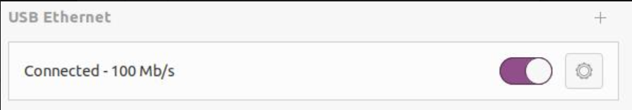
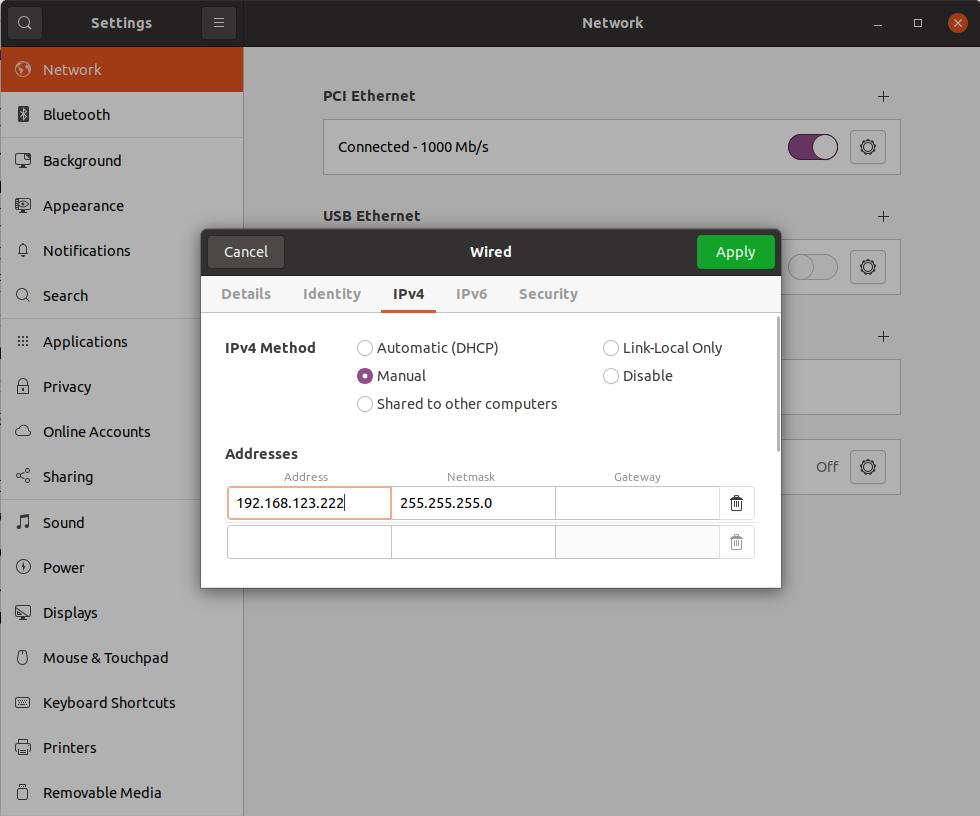
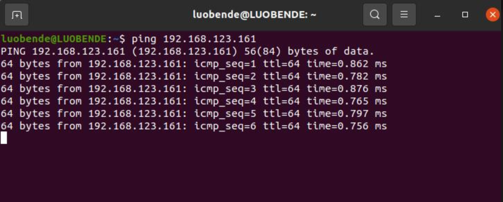
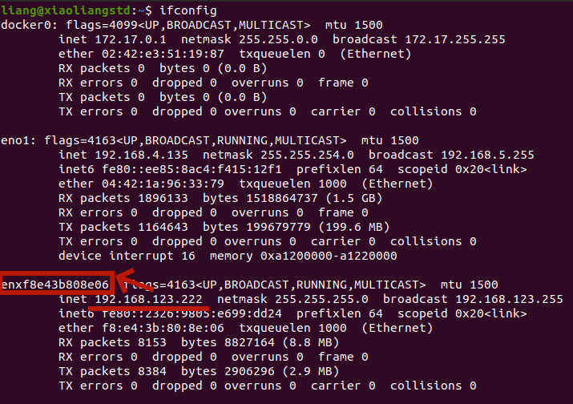

# Go2 Documentation 

This directory contains how to deploy Unitree Go2 in simulaiton and hardware using keyboard. The controller for simulation is trained with custom environment in MuJoCo Playground.

## Installation


### Install Mujoco Playground
> [!IMPORTANT]
> Requires Python 3.10 or later.

1. `git clone git@github.com:google-deepmind/mujoco_playground.git && cd mujoco_playground`
2. Create a virtual environment: `conda create -n go2 python=3.11`
3. Activate it: `conda activate go2`
4. Install CUDA 12 jax: `pip install -U "jax[cuda12]"`
    * Verify GPU backend: `python -c "import jax; print(jax.default_backend())"` should print gpu
5. Install playground: `pip install -e ".[all]"`
6. `pip install onnxruntime hidapi`
7. Verify installation (and download Menagerie): `python -c "import mujoco_playground"`

### Install Unitree SDK2 Python

> [!NOTE]
> Do not pull unitree sdk2 python from offical unitree github.

1. `cd unitree_sdk2_python`
2. `pip3 install -e .`

> [!NOTE]
> If encouter rrror when `pip3 install -e .`: ```bash
Could not locate cyclonedds. Try to set CYCLONEDDS_HOME or CMAKE_PREFIX_PATH``` This error mentions that the cyclonedds path could not be found. Then try the following steps:

```bash
cd ~
git clone https://github.com/eclipse-cyclonedds/cyclonedds -b releases/0.10.x 
cd cyclonedds && mkdir build install && cd build
cmake .. -DCMAKE_INSTALL_PREFIX=../install
cmake --build . --target install
```
Enter the unitree_sdk2_python directory, set `CYCLONEDDS_HOME` to the path of the cyclonedds you just compiled, and then install unitree_sdk2_python.
```bash
cd ~/unitree_sdk2_python
export CYCLONEDDS_HOME="~/cyclonedds/install"
pip3 install -e .
```
For details, see: https://pypi.org/project/cyclonedds/#installing-with-pre-built-binaries

## Usage

### Simulation Evaluation
```bash
python play_go2_keyboard.py
```

### Hardware Testing
> [!Warning]
> Always test your controller in the simulation before deploying on real robots

> [!Caution]
> Wait until the robot is fully started (standing pose) to run the deployment scripts. 

#### Configure the networks. 
1. Connect one end of the network cable to the Go2 robot, and the other end to the user's computer. Turn on the USB Ethernet of the computer and configure it. The IP address of the onboard computer of the machine dog is 192.168.123.161, so it is necessary to set the USB Ethernet address of the computer to the same network segment as the machine dog. For example, entering 192.168.123.222 ("222" can be changed to other) in the Address field.


To test whether the user's computer is properly connected to the built-in computer of the Go2 robot, you can enter ping 192.168.123.161 in the terminal for testing. The connection is successful when something similar to the following appears.


2. View the network card names of the 123 network segment through the ifconfig command, as shown in the following figure:

As shown in the above figure, the network card name corresponding to the IP address 192.168.123.222 is enxf8e43b808e06. Users need to remember this name as it will be a necessary parameter when running the routine.

3. Run the deployment example 
```bash
python traj_following_example.py enxf8e43b808e06
```

## Docker Installation
This instruction will install docker environment as well as jax and CUDA support. The CUDA version is 12.8 with jax version 0.6.8.  
> [!NOTE]
> Docker Installation only works for simulation purposes. The dockerfile does not include unitree sdk2 python installation since it is used for hardware communication

> [!NOTE]
> This instruction assumes docker has been correctly installed in the computer.

1. Install and Configure Nvidia Container Toolkit
```bash
# Install the prerequisites for the instructions below:
sudo apt-get update && apt-get install -y --no-install-recommends \
   curl \
   gnupg2

# Configure the production repository:
curl -fsSL https://nvidia.github.io/libnvidia-container/gpgkey | sudo gpg --dearmor -o /usr/share/keyrings/nvidia-container-toolkit-keyring.gpg \
  && curl -s -L https://nvidia.github.io/libnvidia-container/stable/deb/nvidia-container-toolkit.list | \
    sed 's#deb https://#deb [signed-by=/usr/share/keyrings/nvidia-container-toolkit-keyring.gpg] https://#g' | \
    sudo tee /etc/apt/sources.list.d/nvidia-container-toolkit.list

# Update the packages list from the repository:
sudo apt-get update

# Install the NVIDIA Container Toolkit packages:
export NVIDIA_CONTAINER_TOOLKIT_VERSION=1.18.0-1
  sudo apt-get install -y \
      nvidia-container-toolkit=${NVIDIA_CONTAINER_TOOLKIT_VERSION} \
      nvidia-container-toolkit-base=${NVIDIA_CONTAINER_TOOLKIT_VERSION} \
      libnvidia-container-tools=${NVIDIA_CONTAINER_TOOLKIT_VERSION} \
      libnvidia-container1=${NVIDIA_CONTAINER_TOOLKIT_VERSION}

# Configure the container runtime
sudo nvidia-ctk runtime configure --runtime=docker

# Restart the Docker daemon:
sudo systemctl restart docker
```

2. Post-install steps for Docker 
```bash
sudo groupadd docker
sudo usermod -aG docker $USER
newgrp docker
# Verify Docker
docker run hello-world
```

3. Build docker images
```bash
bash ./build.sh
```

4. Run Docker images
```bash
xhost +local:docker && docker run --rm -it --gpus all --ipc=host --ulimit memlock=-1 --ulimit stack=67108864 -e DISPLAY=$DISPLAY -v /tmp/.X11-unix:/tmp/.X11-unix -v "$HOME/.Xauthority:/root/.Xauthority:rw" playground bash
```

5. Play Examples 
```bash
cd go2doc
python3 play_go2_fix_direction.py
```